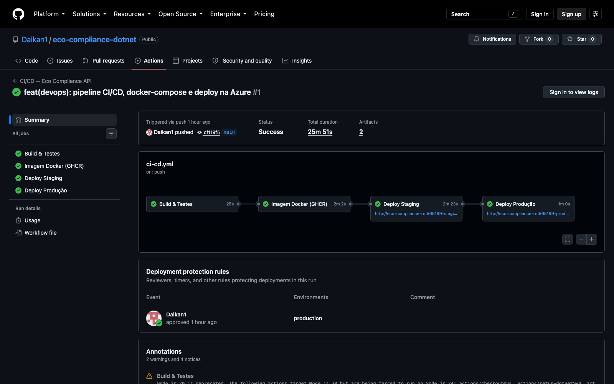
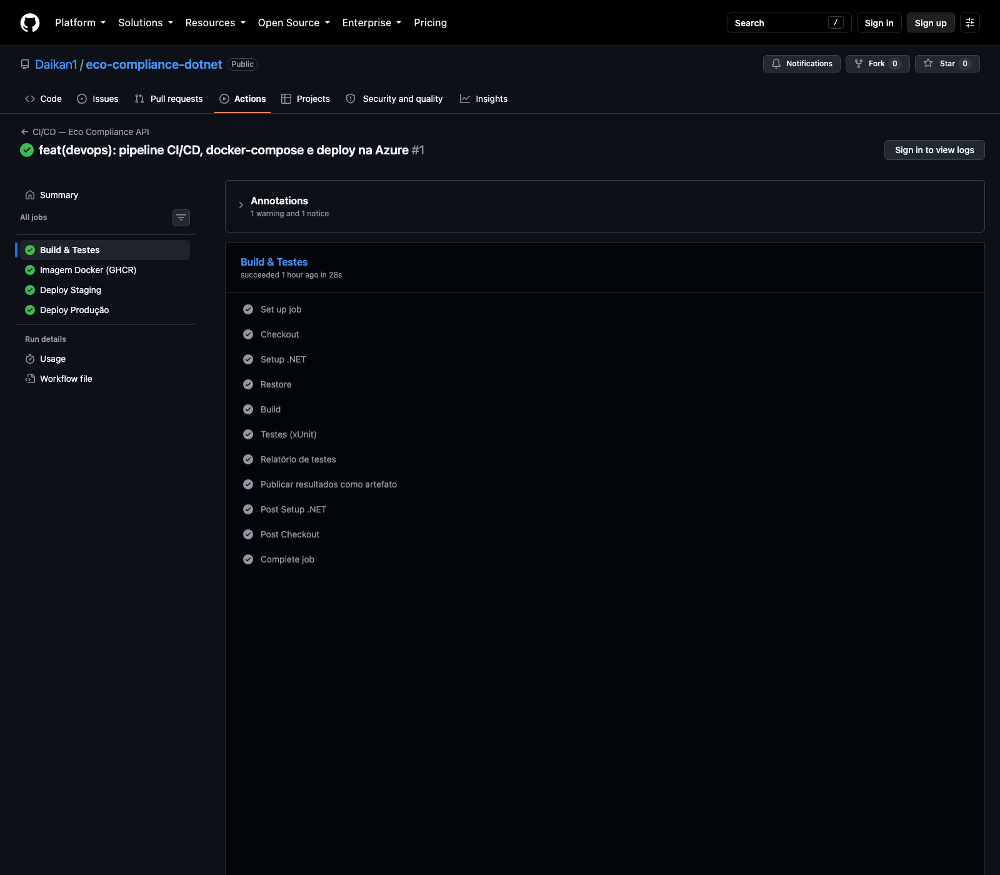
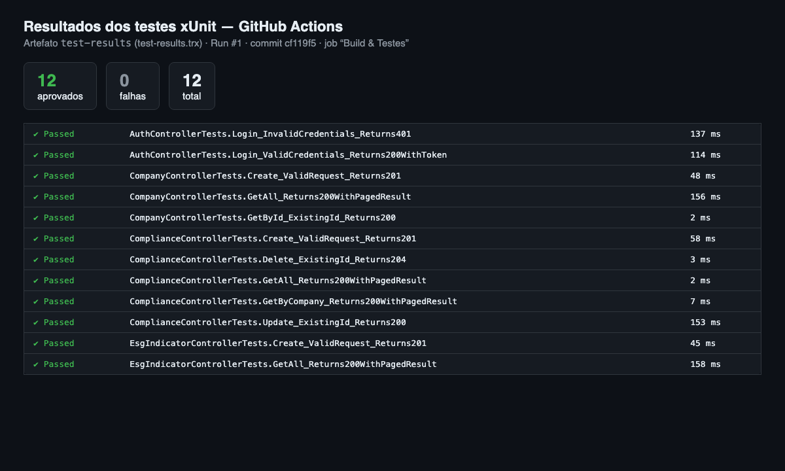
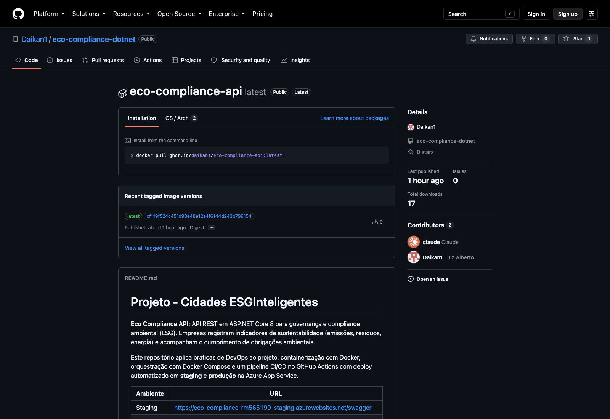
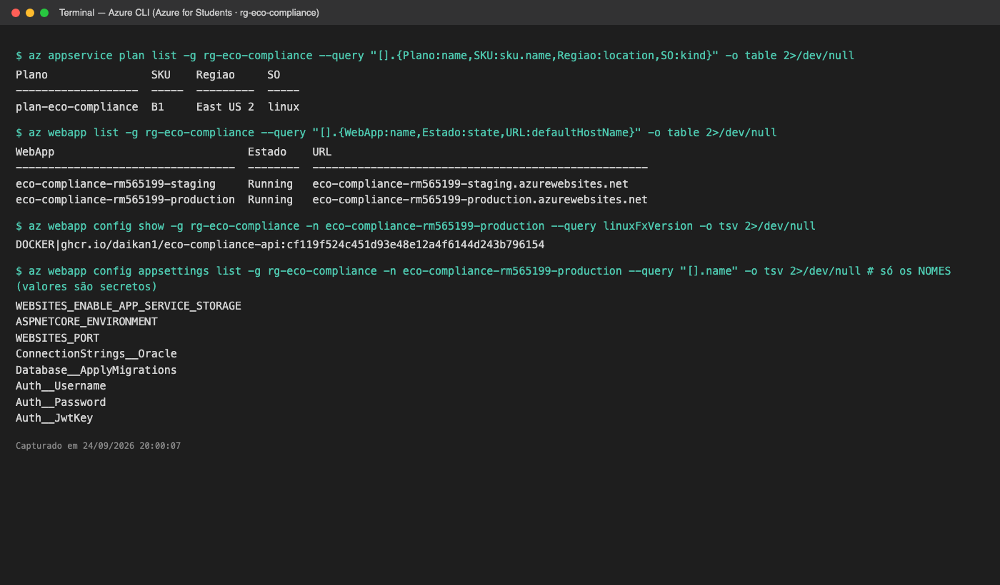
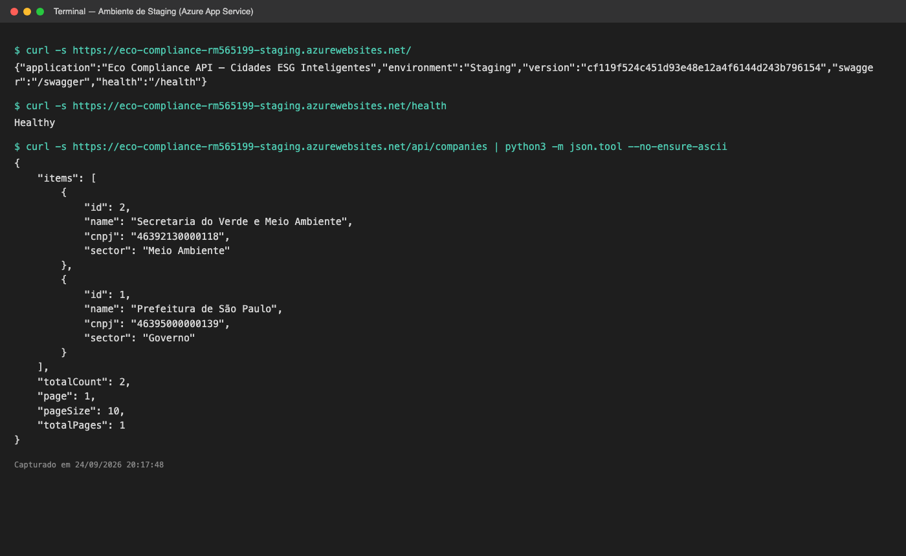
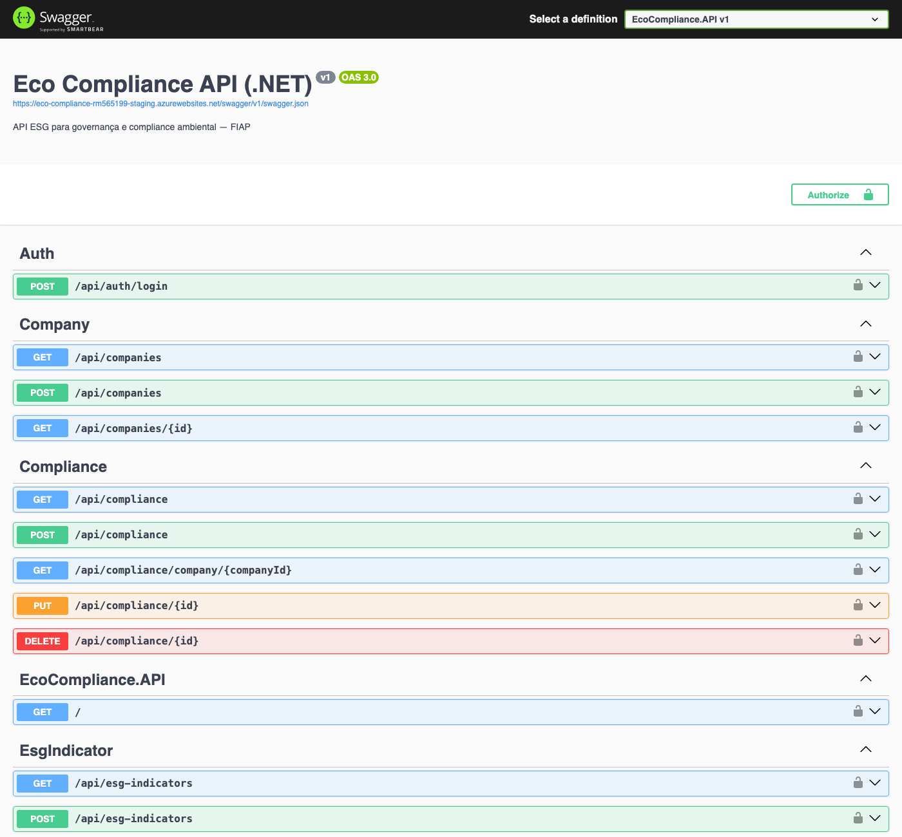
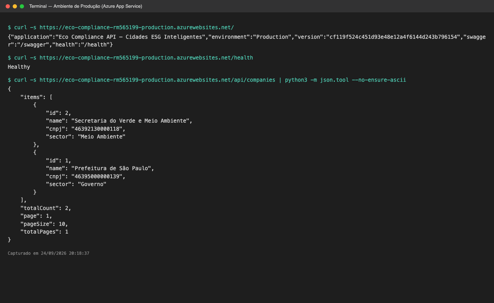
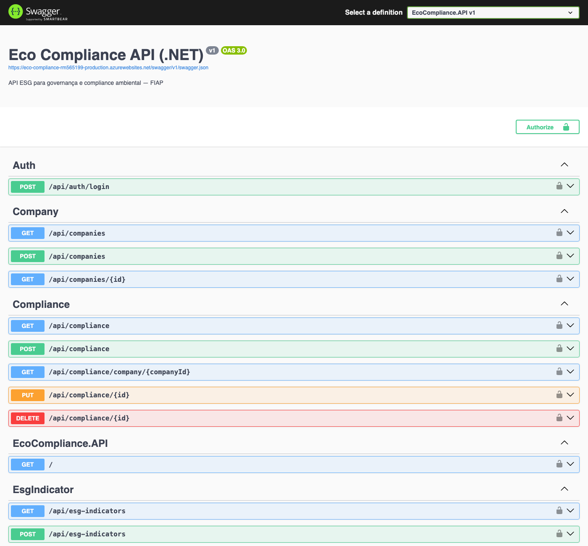
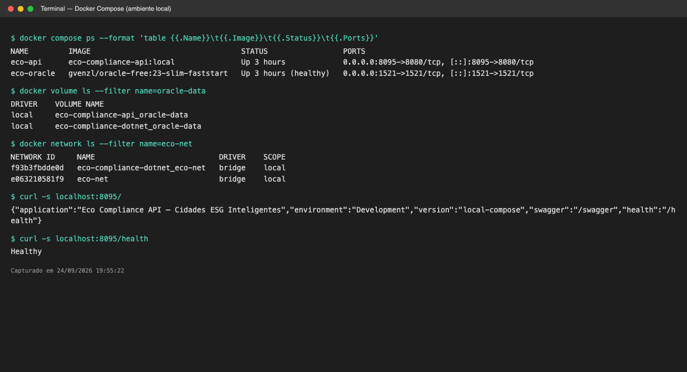

# Projeto - Cidades ESGInteligentes

**Eco Compliance API**: API REST em ASP.NET Core 8 para governança e compliance ambiental (ESG). Empresas registram indicadores de sustentabilidade (emissões, resíduos, energia) e acompanham o cumprimento de obrigações ambientais.

Este repositório aplica práticas de DevOps ao projeto: containerização com Docker, orquestração com Docker Compose e um pipeline CI/CD no GitHub Actions com deploy automatizado em **staging** e **produção** na Azure App Service.

| Ambiente | URL |
|---|---|
| Staging | https://eco-compliance-rm565199-staging.azurewebsites.net/swagger |
| Produção | https://eco-compliance-rm565199-production.azurewebsites.net/swagger |

**Integrante:** Luiz Alberto Silva de Santana, RM565199 (FIAP, 2026)

**Documentação técnica (PDF):** [docs/Documentacao-DevOps-RM565199.pdf](docs/Documentacao-DevOps-RM565199.pdf)

---

## Como executar localmente com Docker

### Pré-requisitos
- [Docker Desktop](https://www.docker.com/products/docker-desktop/) (Docker Engine 24+ com Compose v2)

### Passo a passo

```bash
# 1. Clonar o repositório
git clone https://github.com/Daikan1/eco-compliance-dotnet.git
cd eco-compliance-dotnet

# 2. Criar o arquivo de variáveis de ambiente a partir do modelo
cp .env.example .env        # ajuste as senhas se quiser

# 3. Subir banco Oracle + API
docker compose up -d --build

# 4. Acompanhar os logs (o Oracle leva cerca de 1 minuto no primeiro start)
docker compose logs -f api
```

Quando o log mostrar `Migrations aplicadas com sucesso`, a API está no ar:

| Recurso | URL |
|---|---|
| Swagger | http://localhost:8080/swagger |
| Health check | http://localhost:8080/health |
| Ambiente e versão | http://localhost:8080/ |

Para autenticar, chame `POST /api/auth/login` com o usuário e senha definidos no `.env` (`AUTH_USERNAME` e `AUTH_PASSWORD`), copie o token e clique em **Authorize** no Swagger.

```bash
docker compose down        # parar (os dados do Oracle continuam no volume)
docker compose down -v     # parar e apagar o volume do banco
```

### Sem Docker (opcional)
```bash
dotnet run --project EcoCompliance.API    # exige .NET 8 SDK e um Oracle acessível
dotnet test                               # roda os testes
```

---

## Pipeline CI/CD

**Ferramenta:** GitHub Actions ([`.github/workflows/ci-cd.yml`](.github/workflows/ci-cd.yml))
**Registry:** GitHub Container Registry (`ghcr.io/daikan1/eco-compliance-api`)
**Hospedagem:** Azure App Service (Web App for Containers, Linux), com um app por ambiente

```
push na main
   │
   ▼
┌──────────────┐   ┌────────────────┐   ┌────────────────┐   ┌──────────────────┐
│ Build &      │──▶│ Imagem Docker  │──▶│ Deploy         │──▶│ Deploy           │
│ Testes       │   │ build + push   │   │ STAGING        │   │ PRODUÇÃO         │
│ (dotnet)     │   │ (GHCR)         │   │ + smoke test   │   │ (aprovação       │
└──────────────┘   └────────────────┘   └────────────────┘   │  manual) + smoke │
                                                             └──────────────────┘
```

| # | Job | O que faz |
|---|---|---|
| 1 | **Build & Testes** | `dotnet restore`, `dotnet build -c Release` e `dotnet test` (12 testes xUnit com Moq). Publica o relatório dos testes na aba *Checks* e os arquivos `.trx` como artefato. Em pull request, o pipeline para aqui. |
| 2 | **Imagem Docker (GHCR)** | Faz o build da imagem com o [Dockerfile](Dockerfile), injeta o commit SHA como `APP_VERSION` e publica no GHCR com as tags `:<sha>` e `:latest`. Usa cache de camadas do GitHub Actions. |
| 3 | **Deploy Staging** | Atualiza o Web App de staging para a imagem `:<sha>` via `azure/webapps-deploy`. O *smoke test* consulta `GET /` até a resposta trazer o SHA novo e confere `GET /health`. |
| 4 | **Deploy Produção** | Só roda se staging passou. O environment `production` exige **aprovação manual** no GitHub. Faz o deploy da **mesma imagem** testada em staging e repete o smoke test. |

**Segredos e configuração** ficam fora do código:
- No GitHub, cada Environment (`staging` e `production`) tem o secret `AZURE_WEBAPP_PUBLISH_PROFILE` e a variável `AZURE_WEBAPP_NAME`.
- Na Azure, as *App Settings* de cada Web App guardam `ConnectionStrings__Oracle`, `Auth__Password`, `Auth__JwtKey` e `ASPNETCORE_ENVIRONMENT` (`Staging` ou `Production`).

### Provisionar a infraestrutura

O script [`scripts/azure-setup.sh`](scripts/azure-setup.sh) cria tudo com Azure CLI e GitHub CLI: Resource Group, App Service Plan, os dois Web Apps, as App Settings, os GitHub Environments e os secrets.

```bash
brew install azure-cli
az login
gh auth login
./scripts/azure-setup.sh
```

---

## Containerização

### Dockerfile

```dockerfile
# ── Stage 1: Build ────────────────────────────────────────────────────────────
FROM mcr.microsoft.com/dotnet/sdk:8.0 AS build
WORKDIR /src

# Restore separado do código-fonte: aproveita o cache de camadas do Docker
COPY ["EcoCompliance.API/EcoCompliance.API.csproj", "EcoCompliance.API/"]
RUN dotnet restore "EcoCompliance.API/EcoCompliance.API.csproj"

COPY . .
WORKDIR "/src/EcoCompliance.API"
RUN dotnet publish "EcoCompliance.API.csproj" -c Release -o /app/publish /p:UseAppHost=false --no-restore

# ── Stage 2: Runtime ──────────────────────────────────────────────────────────
FROM mcr.microsoft.com/dotnet/aspnet:8.0 AS final

# Versão (commit SHA) injetada pelo pipeline — exibida em GET /
ARG APP_VERSION=local

LABEL org.opencontainers.image.title="eco-compliance-api" \
      org.opencontainers.image.description="API ESG — Cidades ESG Inteligentes (FIAP)" \
      org.opencontainers.image.source="https://github.com/Daikan1/eco-compliance-dotnet"

WORKDIR /app
EXPOSE 8080

ENV ASPNETCORE_ENVIRONMENT=Production \
    ASPNETCORE_HTTP_PORTS=8080 \
    APP_VERSION=${APP_VERSION}

COPY --from=build /app/publish .

# Executa como usuário sem privilégios (já existe na imagem oficial)
USER $APP_UID

# Credenciais NUNCA vão na imagem — são passadas por variáveis de ambiente:
#   ConnectionStrings__Oracle, Auth__Password, Auth__JwtKey
ENTRYPOINT ["dotnet", "EcoCompliance.API.dll"]
```

### Estratégias adotadas

| Estratégia | Motivo |
|---|---|
| **Multi-stage build** | O SDK (cerca de 800 MB) só existe no estágio de build. A imagem final usa apenas o runtime ASP.NET (cerca de 220 MB). |
| **Restore em camada separada** | O `dotnet restore` só roda de novo quando o `.csproj` muda, o que acelera rebuilds locais e no CI. |
| **Usuário sem privilégios** (`USER $APP_UID`) | O processo não roda como root dentro do container. |
| **Sem segredos na imagem** | O `.dockerignore` exclui `.env` e `appsettings.Development.json`. As credenciais entram só por variáveis de ambiente. |
| **Versão rastreável** | O SHA do commit fica gravado na imagem (`APP_VERSION`) e aparece em `GET /`, o que prova qual versão está rodando em cada ambiente. |
| **Imagem imutável entre ambientes** | Staging e produção recebem exatamente a mesma imagem `:<sha>`. Só mudam as variáveis de ambiente. |

### Orquestração (`docker-compose.yml`)

| Serviço | Imagem | Função |
|---|---|---|
| `oracle` | `gvenzl/oracle-free:23-slim-faststart` | Banco Oracle 23ai Free (roda em Intel e Apple Silicon) com health check |
| `api` | build local do Dockerfile | Sobe só depois que o Oracle fica *healthy* e aplica as migrations do EF Core automaticamente |

- **Volume:** `oracle-data` guarda os dados do banco entre reinícios.
- **Rede:** `eco-net` (bridge). A API acessa o banco pelo hostname `oracle`.
- **Variáveis de ambiente:** lidas do `.env` (modelo em [`.env.example`](.env.example)).

---

## Prints do funcionamento

> Todas as imagens estão em [`docs/prints/`](docs/prints/). Execução de referência: [run #1 do pipeline](https://github.com/Daikan1/eco-compliance-dotnet/actions/runs/36061368483), commit `cf119f5`.

### 1. Pipeline completo: 4 jobs verdes e aprovação manual de produção


### 2. Build e testes automatizados
Etapas do job **Build & Testes**:



Relatório gerado pelo pipeline (artefato `test-results.trx`): **12 testes aprovados, 0 falhas**.



### 3. Imagem Docker publicada no GitHub Container Registry


### 4. Infraestrutura na Azure (App Service Plan B1 e dois Web Apps)


### 5. Staging funcionando
`GET /` retorna `environment: Staging` e o SHA do commit. `/health` retorna `Healthy`. `/api/companies` lê do Oracle.




### 6. Produção funcionando
Mesma imagem (`cf119f5`) promovida após aprovação, com `environment: Production`.




### 7. Ambiente local com Docker Compose
Containers `eco-api` e `eco-oracle` (healthy), volume `oracle-data` e rede `eco-net`.



---

## Tecnologias utilizadas

| Categoria | Tecnologias |
|---|---|
| Linguagem e framework | C#, .NET 8, ASP.NET Core Web API |
| Persistência | Oracle Database (FIAP / Oracle 23ai Free no Docker), Entity Framework Core 8, Oracle.EntityFrameworkCore |
| Segurança | JWT Bearer Authentication |
| Documentação da API | Swagger (Swashbuckle) |
| Testes | xUnit, Moq |
| Containers | Docker (multi-stage), Docker Compose |
| CI/CD | GitHub Actions, GitHub Environments, GitHub Container Registry |
| Nuvem | Azure App Service (Web App for Containers, Linux) |
| Ferramentas | Azure CLI, GitHub CLI, Postman |

---

## Endpoints

| Método | Rota | Auth | Descrição |
|---|---|---|---|
| `GET` | `/` | — | Ambiente e versão em execução |
| `GET` | `/health` | — | Health check |
| `POST` | `/api/auth/login` | — | Autentica e retorna JWT |
| `GET` | `/api/companies` | — | Lista empresas (paginado) |
| `GET` | `/api/companies/{id}` | — | Retorna empresa por ID |
| `POST` | `/api/companies` | JWT | Cadastra empresa |
| `GET` | `/api/compliance` | — | Lista registros de compliance |
| `GET` | `/api/compliance/company/{id}` | — | Compliance por empresa |
| `POST` | `/api/compliance` | JWT | Cria registro de compliance |
| `PUT` | `/api/compliance/{id}` | JWT | Atualiza registro |
| `DELETE` | `/api/compliance/{id}` | JWT | Remove registro |
| `GET` | `/api/esg-indicators` | — | Lista indicadores ESG |
| `POST` | `/api/esg-indicators` | JWT | Registra indicador ESG |

## Estrutura do projeto

```
eco-compliance-dotnet/
├── .github/workflows/ci-cd.yml   # Pipeline CI/CD
├── EcoCompliance.API/            # Código-fonte da API
├── EcoCompliance.Tests/          # Testes xUnit
├── scripts/                      # azure-setup.sh, set-db-password.sh, seed-demo.sh
├── docs/                         # Documentação técnica (PDF) e prints/
├── Dockerfile
├── docker-compose.yml
├── .env.example
└── README.md
```

---

## Checklist de entrega

| Item | OK |
|---|---|
| Projeto compactado em .ZIP com estrutura organizada | ☑ |
| Dockerfile funcional | ☑ |
| docker-compose.yml ou arquivos Kubernetes | ☑ |
| Pipeline com etapas de build, teste e deploy | ☑ |
| README.md com instruções e prints | ☑ |
| Documentação técnica com evidências (PDF ou PPT) | ☑ |
| Deploy realizado nos ambientes staging e produção | ☑ |
